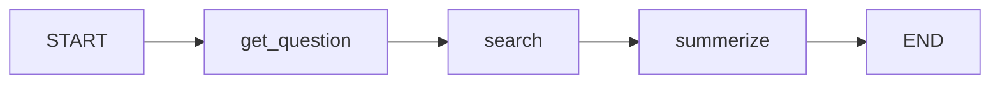

# 🔄 LangGraph DAG Workflow - Streamlit App

A research and summarization system using LangGraph's directed acyclic graph (DAG) workflow with state management.

## 🌟 Features

- **3-Node DAG Workflow:**
  - 📝 **Get Question**: Normalizes and prepares the input question
  - 🔍 **Search**: Researches the topic using Google Gemini LLM
  - 📊 **Summarize**: Creates 3-5 bullet point summary of findings

- **Interactive UI:**
  - Visual graph representation of the workflow
  - Model selection (Gemini 2.0 Flash, 1.5 Flash, 1.5 Pro)
  - 2-tab interface showing summary and detailed execution steps
  - Download summary as text file
  - Real-time progress indicators

- **Built with LangGraph:**
  - Demonstrates state management across nodes
  - Sequential edge connections (START → get_question → search → summarize → END)
  - Type-safe state using TypedDict
  - Compiled graph ready for execution

## 🚀 Quick Start

### 1. Install Dependencies

```bash
cd day013_langgraphDAG
pip install -r requirements.txt
```

### 2. Configure API Key

The app uses `.streamlit/secrets.toml` for secure API key storage.

Create a `.streamlit/secrets.toml` file:

```toml
GEMINI_API_KEY = "your-gemini-api-key-here"
```

Alternatively, you can enter your API key directly in the UI when prompted.

### 3. Run the App

```bash
streamlit run streamlit_app.py
```

The app will open in your default browser at `http://localhost:8501`

## 🎯 How to Use

1. **Enter Your Question**: Type any topic or question you want researched
2. **Select Model** (optional): Choose between Gemini models in sidebar
3. **Toggle Graph Visualization** (optional): View the workflow DAG structure
4. **Click "Execute Workflow"**: Watch the LangGraph DAG process your question
5. **View Results**:
   - **Summary Tab**: See the final bullet point summary and download it
   - **Detailed Steps Tab**: Review each node's output in the workflow

## 📋 API Key Required

- **Gemini API Key**: For Google's Gemini LLM (get it from [Google AI Studio](https://makersuite.google.com/app/apikey))

## 🛠️ Technology Stack

- **LangGraph**: State graph orchestration framework
- **LangChain**: LLM integration and prompt management
- **Streamlit**: Web interface
- **Google Gemini**: Language model (2.0 Flash, 1.5 Flash, or 1.5 Pro)

## 📝 Example Questions

- "What is LangGraph?"
- "Explain Artificial General Intelligence"
- "What are the benefits of using directed acyclic graphs in workflows?"
- "How does state management work in LangGraph?"
- "What is the difference between LangChain and LangGraph?"

## 🏗️ Workflow Structure



### State Schema

```python
class State(TypedDict):
    question: str    # Input question
    search: str      # Research results
    summerize: str   # Final summary
```

## 🔒 Security

- API keys are stored in `.streamlit/secrets.toml` (automatically gitignored)
- Keys can also be entered securely via the UI
- Never commit secrets.toml to version control

## 📄 Project Structure

```
day013_langgraphDAG/
├── streamlit_app.py              # Main application
├── LangGraph_DAG.ipynb           # Original Jupyter notebook
├── .streamlit/
│   └── secrets.toml              # API keys (gitignored)
├── requirements.txt              # Python dependencies
├── .gitignore                   # Git ignore rules
└── README.md                    # This file
```

## 🎓 Learning Concepts

This project demonstrates:
- **State Management**: How state flows through graph nodes
- **Graph Construction**: Building a DAG with StateGraph
- **Edge Connections**: Sequential workflow execution
- **LLM Integration**: Using chains with prompts and output parsers
- **Type Safety**: Using TypedDict for state definitions

## 🤝 Contributing

This is a learning project. Feel free to experiment and extend functionality!

## 📜 License

Educational project - free to use and modify.

